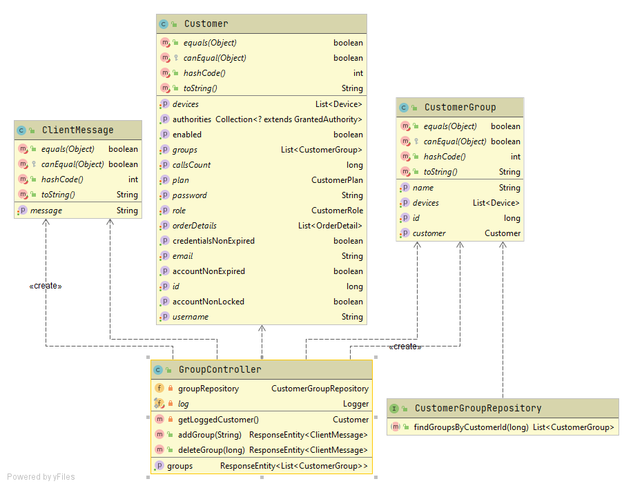
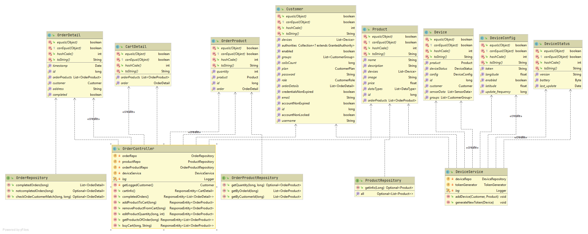

# UML diagrams
We have split the class diagram on the basis of the controller’s logic, otherwise the diagram would be too big. The project consists of 6 controllers, one for each entity except for DataType: CustomerController, OrderController, ProductController, DeviceController, SensorDataController, GroupController. There is one repository interface for each entity that contains the SQL queries regarding the specific entity. 
In the controller classes we have the declaration of the REST API endpoints. The controllers use models, repositories and services to elaborate the REST requests.

