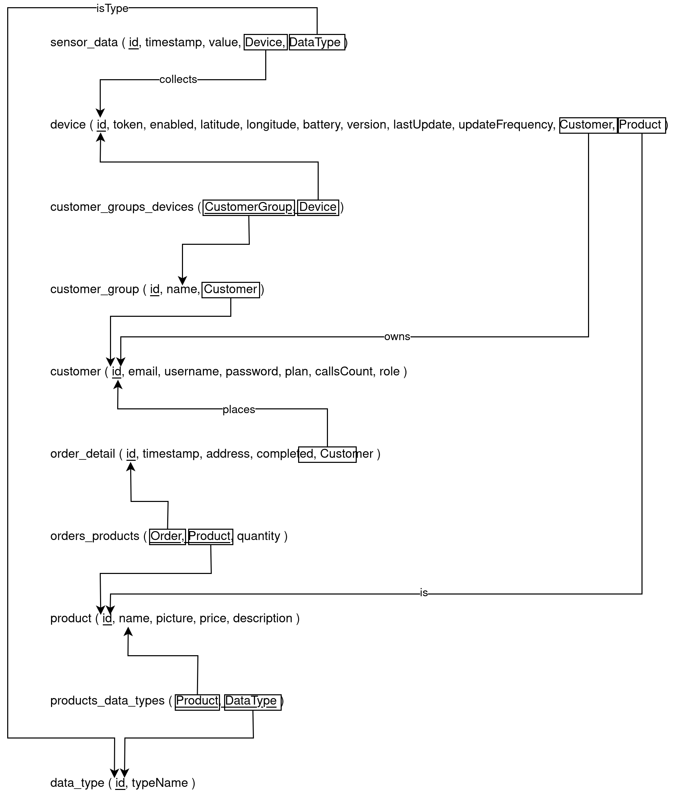

# ER diagram

# ER diagram Restructured

# Realetional diagram

# Realetional diagram 2 (different names)

# Table names in the implemetation
CUSTOMER 		&nbsp;	customer\\
CUSTOMERGROUP	&nbsp;	customer_group\\
BELONGS			&nbsp;	customer_groups_devices\\
DATATYPE		&nbsp;	data_type\\
DEVICE			&nbsp;	device\\
ORDER  			&nbsp;	order_detail\\
CONTAINS		&nbsp;	orders_products\\
PRODUCT			&nbsp;	product\\
HAS				&nbsp;	products_data_types\\
SENSORDATA		&nbsp;	sensor_data\\

## Useful posgre-sql commands
`\l`					List of databases
`\c database-name`		Use this database
`\dt`					List of the tables of the current database
`\d table_name`			List of the attributes of the table

