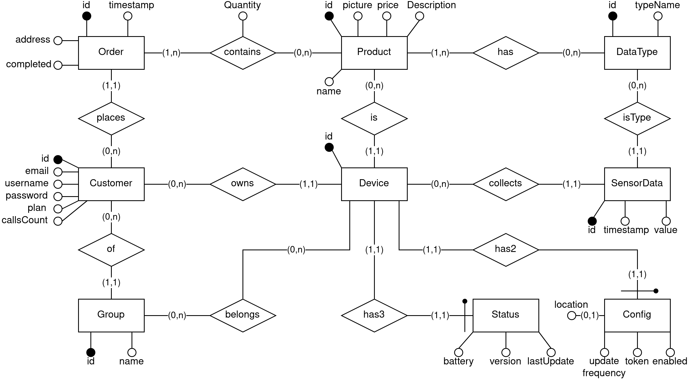
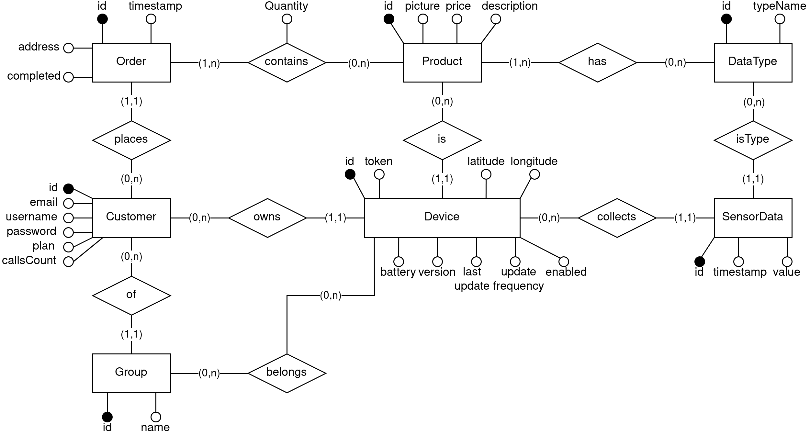
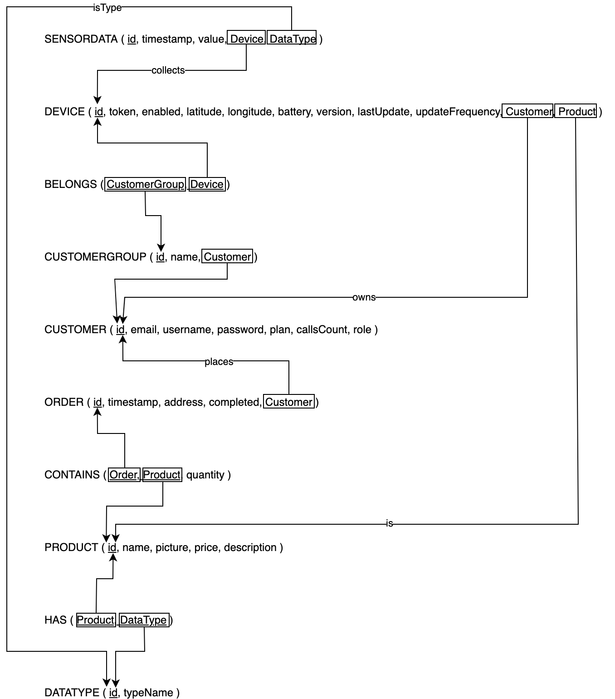

# ER diagram

# ER diagram Restructured

# Realetional diagram

# Table names in the implemetation
CUSTOMER 		customer
CUSTOMERGROUP	customer_group
BELONGS			customer_groups_devices
DATATYPE		data_type
DEVICE			device
ORDER  			order_detail
CONTAINS		orders_products
PRODUCT			product
HAS				products_data_types
SENSORDATA		sensor_data

## Useful posgre-sql commands
`\l`					List of databases
`\c database-name`		Use this database
`\dt`					List of the tables of the current database
`\d table_name`			List of the attributes of the table

